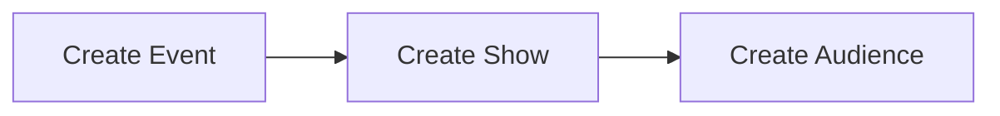
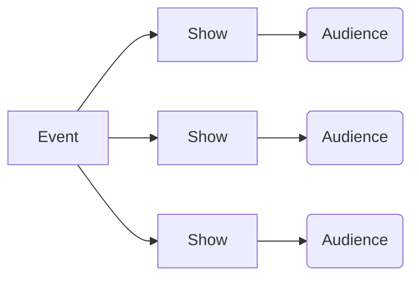

# Take A Seat

TakeASeat is an online ticket distribution platform. The application allows the user to create event,event-related shows, and specific audiences for each show instance. 

The application has been created to learn ASP.NET Core 6 WEB API, Entity Framework and Prime React Framework. 

> Home Page


## Table of content

[Technologies](#technologies)

[Description](#description)

[Contributing](#contributing)

[License](#license)

## Technologies


## Description

The application allows the user to search for a specific event. Each event is described by an event type and tag group. The platform is intended for use by registered users only. Each registered user is assigned the "User" role. The user can buy tickets for shows. There are also "Organizer" and "Administrator" roles. Organizers can create events, shows, and audiences. Administrators can manage other user roles.

In order to sell tickets, you need to follow three steps:
1. The organizer creates a show and enables the purchase of tickets:

> Organizer Panel


2. The user can reserve seats for each show. However, the user must pay for each reserved seat within five minutes. Otherwise, the reservation is released.

> Seat Reservation


3. Once the payment is accepted by both the payment provider and the TakeASeat app, the tickets are created and emailed to the user.

#### Events Content

The organizer has the right to create and modify his own event. Each event can have multiple instances of shows with different dates and descriptions.

Once a show has been created, it is not yet available for sale. The organizer must create a seated audience. The seats are described by four parameters: row, column, price and color of the seat. Only after seats are created, regular users can reserve them.

> Seat Audience Creation


Reserved seats must be purchased. The user has five minutes to use the payment service and purchase tickets. Otherwise, the app will release unpaid bookings.

Finally, once payment is accepted, tickets for each seat purchased are generated and emailed to the user.

#### User Managment

The application allows you to create user accounts. Passwords are verified by both Prime React and ASP.NET Core.
Authentication and authorization is performed by JW Token. Also JWT is used to transfer data between frontend and backend. The token is stored in a local store and made available to React as a context.

#### Payment

The payment for boying tickets is made by dotpay.pl service (sandbox mode is used). Payment service goes as follows:

- After the user is ready to make payment, the order record in database is created.

- The user is redirected to the payment webstie - he needs to choose the form of the payment and actually make it. With the user's redirection, there is also a flow of the operation data between the backend and the dotpay server. In addition to the payment data, an operation signature created by the application is sent.

- In response, the dotpay service sends back data with the operation data and the payment signature. The signature and data are then compared with the signature generated by the application and the data stored in the database. If everything is correct, the backend creates tickets and finalizes the transaction by sending them to the user. Since the application is not deployed and cannot get a response from the dotpay server, the response is mocked.

#### Frontend

The frontend was created almost entirely in React and React Prime framework. React Router was used to manage the application urls. User's data was shared between React components via Context Provider. Every main component of the application was made mainly in RESTful API. 

#### Tests

The application is tested in the xUnit framework. The unit tests are made using FakeItEasy and FluentAssertion libraries. The database is being mocked in the memory database service.

#### Docker

The application is dockerized. The backend, the database and the frontend (with Nginx) are builded.

```
version: "3.8"
	services:		
		backend:
			//...
		eventsDb:
			//...
		frontend: 
			//...
		nginx:
			//...
```
## Installation
To run application in Docker you need to create appsettings.json file inside ```backend/TakeASeat/TakeASeat/``` .
The appsettings.json should look like this:
```
{
  "ConnectionStrings": {
    "DefaultConnection": "server=localhost\\sqlexpress;database=TakeASeat;trusted_connection=true;TrustServerCertificate=True"
  },
  "Logging": {
    "LogLevel": {
      "Default": "Information",
      "Microsoft.AspNetCore": "Warning"
    }
  },
  "Jwt": {
    "Issuer": "TakeASeat",
    "lifetime": 15
  },
  "AllowedHosts": "*",
  "PaymentServerData": {
    "PIN": "PIN",
    "ID": "ID"
  },
  "EmailProviderData": {
    "PASSWORD": "emailPassword",
    "ADDRESS": "email@gmail.com"
  }
}
```
To run ASP.NET locally just change DefaultConnection string to ```server=localhost\\sqlexpress;database=TakeASeat;trusted_connection=true;TrustServerCertificate=True```

## Contributing
Pull requests are welcome. For major changes, please open an issue first to discuss what you would like to change.

Please make sure to update tests as appropriate.

## License

[MIT](https://choosealicense.com/licenses/mit/)
